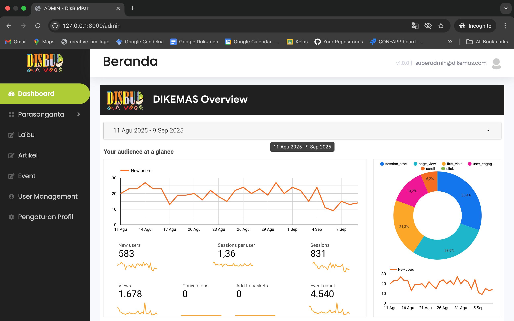
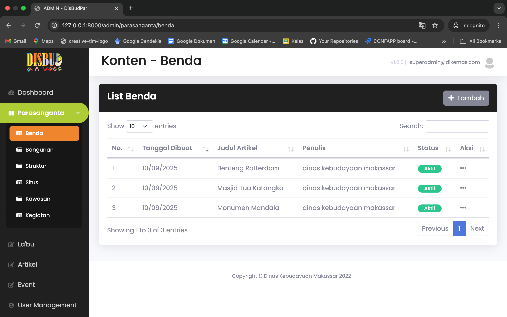
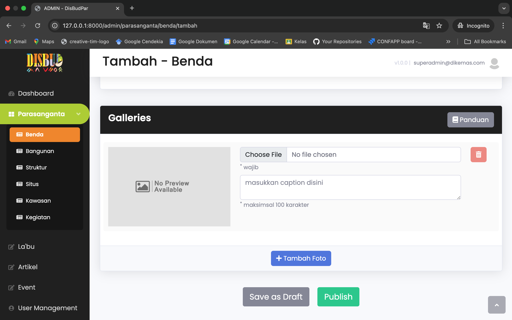
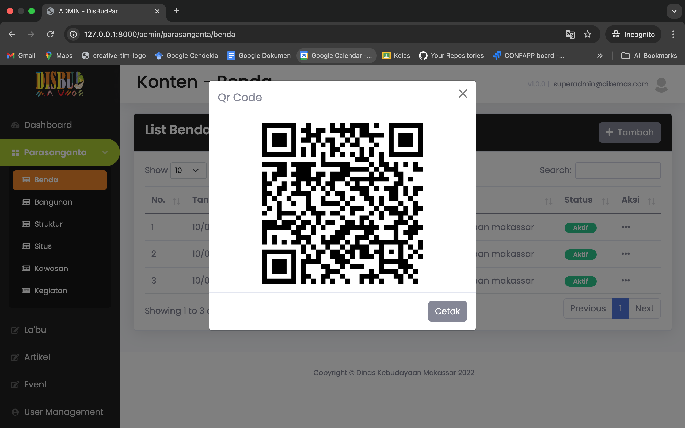
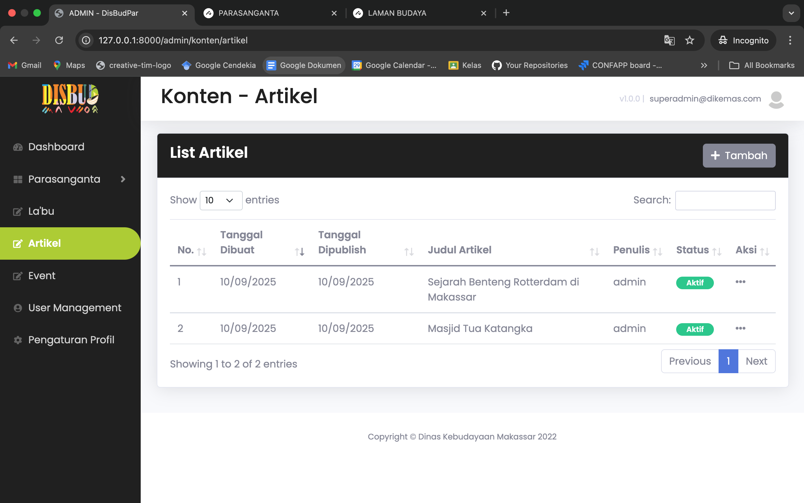
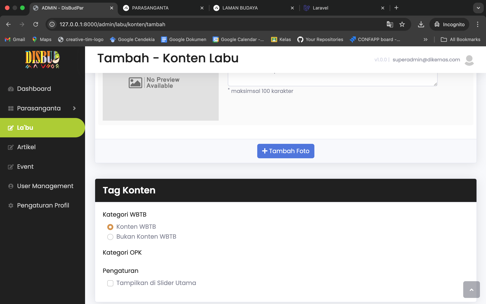

# 🏛️ Sistem Informasi Cagar Budaya (Parasanganta & Labu)

Proyek ini adalah aplikasi berbasis web untuk pengelolaan dan publikasi **Cagar Budaya** yang terdiri dari dua portal utama: **Parasanganta** dan **Labu**.  

---

## 🚀 Fitur Utama

### 1. Portal Publik (Parasanganta & Labu)  
Saat pertama kali mengakses portal publik, masyarakat disuguhi 2 pilihan portal:  
- **Parasanganta**  
- **Labu**  

---

### 2. Parasanganta   
Pengunjung dapat melihat **artikel, galeri, video, dan kontak**.  

---

### 3. Labu  
Pengunjung dapat melihat **artikel, galeri, video, dan kontak**.  

---

### 4. Detail Artikel (Parasanganta & Labu)  
Halaman artikel memuat informasi lengkap tentang artikel yang dipilih.  

Portal ini bersifat **responsif**, sehingga dapat diakses dengan baik di desktop maupun perangkat mobile.  

---

### 5. Dashboard Admin  
Menampilkan ringkasan data cagar budaya, statistik jumlah artikel, galeri, video, serta aktivitas terbaru admin.  
Dashboard ini membantu admin memantau sistem secara menyeluruh dengan cepat.  

---

### 6. Manajemen Data Cagar Budaya  
Admin dapat melakukan **CRUD (Create, Read, Update, Delete)** untuk data:  
- Benda  
- Situs  
- Bangunan  
- Struktur  
- Kawasan Kegiatan  

Setiap entri data dilengkapi dengan **lokasi, deskripsi, gambar, dan metadata lainnya** agar lebih informatif.  

  
*Salah satu tampilan List Tabel dari manajemen data cagar budaya*  

  
*Salah satu tampilan Tambah Data dari manajemen data cagar budaya*  

---

### 7. Integrasi QR Code  
Setiap data cagar budaya otomatis memiliki **QR Code** yang dapat di-scan oleh publik untuk melihat detail informasi.  
QR Code dapat dicetak dan ditempel di lokasi cagar budaya agar pengunjung bisa langsung mengakses informasi melalui smartphone.  

---

### 8. Manajemen Konten Artikel 
Fitur untuk menambahkan **artikel** dengan kategori:  
- Umum  
- Hari Kebudayaan  
- Kampung Budaya / Lorong Wisata  

Artikel yang dibuat akan langsung muncul di portal publik Parasanganta & Labu.  

  
*Tampilan list tabel artikel*  

---

### 9. Manajemen Konten Labu
Fitur untuk menambahkan, mengelola, dan mempublikasikan informasi terkait **Warisan Budaya Takbenda (WBTB)** maupun konten lain yang berkaitan dengan kebudayaan di sistem **DIKEMAS**.  

---

---

## 🔑 Hak Akses & Fitur

| Role                   | Hak Akses Utama             | Fitur yang Didapat |
|------------------------|-----------------------------|--------------------|
| **SuperAdmin**         | Full akses (global)         | Manajemen user, data, QR code, semua konten |
| **Admin Parasanganta** | Kelola portal Parasanganta  | CRUD Artikel, Galeri, Video, QR code |
| **Admin Labu**         | Kelola portal Labu          | CRUD Artikel, Galeri, Video, QR code |
| **Publik**             | Hanya lihat portal          | Lihat konten, scan QR code, kontak |

---

## ⚙️ Teknologi yang Digunakan

- **Frontend**:  
  - HTML, CSS (**Bootstrap**)  
  - JavaScript (**jQuery**)  

- **Backend**:  
  - **Laravel** (PHP Framework)  
  - **PostgreSQL** (Database)  

---

## 📬 Catatan  
Jika ingin melihat kode proyek ini, silakan hubungi saya melalui email: **didindong30@gmail.com**
